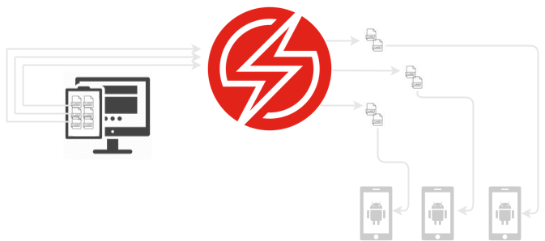

# Espresso Sauce Config action
<style>
.label {
  color: white;
  padding: 8px;
  font-family: Arial;
}
.success {background-color: #04AA6D;} /* Green */
.danger {background-color: #f44336;} /* Red */ 
</style>

<span class="label success">Real Device Support</span> <span class="label success">Virtual Device Support</span>

This page defines each of the configuration parameters that is required for running Espresso tests on the Sauce Labs platform. Please note, in order for you to use this plugin to execute UI tests, your test class names must proceed with `Spec`, `Specs`, `Tests`, or `Test`**, for example, `ExampleSpec`, `ExampleSpecs`, `ExampleTest`, `ExampleTests`. Your test case names must also begin with `test`, for example, `testIDoSomething`, `testIDoSomethingElse`. 

**These naming conventions are required so that this plugin can scan for test classes and their defined test cases**.

# Help
Information and help for the `sauce_config` action can be printed out by executed the following command:
```sh
fastlane action sauce_config
```
--------------------------------------------------------------------

# Parameters

## `platform`

| Required   | Type     | Description                     | Options         |
|------------|----------|---------------------------------|-----------------|
| ***true*** | `String` | Application under test platform | `android`       |   

---------------------------------------------------------------------
## `kind`

| Required   | Type     | Description                                                                                        | Options               |
|------------|----------|----------------------------------------------------------------------------------------------------|-----------------------|
| ***true*** | `String` | Specifies which framework is associated with the automation tests configured in this specification | `espresso`|   

---------------------------------------------------------------------
## `app`

| Required   | Type     | Description                            | 
|------------|----------|----------------------------------------|
| ***true*** | `String` | The path to the application under test |

---------------------------------------------------------------------
## `test_app`

| Required   | Type     | Description                                       | 
|------------|----------|---------------------------------------------------|
| ***true*** | `String` | The path to the testing application (test runner) |

---------------------------------------------------------------------
## `region`

| Required   | Type     | Description                                            | Options   |
|------------|----------|--------------------------------------------------------|-----------|
| ***true*** | `String` | Data Center region (us or eu), set using: region: 'eu' | `us`,`eu` |   

---------------------------------------------------------------------
## `retries`

| Required    | Type      | Description                                      | 
|-------------|-----------|--------------------------------------------------|
| ***false*** | `Integer` | Sets the number of times to retry a failed suite |

---------------------------------------------------------------------
## `test_distribution`

| Required    | Type     | Description                   | 
|-------------|----------|-------------------------------|
| ***false*** | `String` | Test run distribution method. |

### What is `test_distribution`?
One of the only drawbacks of the native sauce platform is the long-running test runs or suite videos. Long-running videos make it difficult to debug failures, for example; if you have a single suite of tests that takes 10 minutes to execute, and that execution contains a single failure, you would need to scroll through a ten-minute video in order to view the test failure. This can be quite frustrating!
If you distribute suites by test case it may take slightly longer, however, you will save far more time debugging failures, and can save and share a short video of the exact failure.

## Test distribution options

The saucectl plugin will scan the specified path to tests for test classes, test cases, or packages. 
The plugin will then instruct saucectl to treat each specified option as a suite per specified device(s) or virtual device(s).

| Distribution method       | Description                                                                    | 
|---------------------------|--------------------------------------------------------------------------------|
| `testCase`                | Considers 1 test case equal to 1 suite per device or virtual device under test |
| `class`                   | Considers 1 test class to 1 suite per device or virtual device under test      |
| `package`                 | Considers 1 package equal to 1 suite per device or virtual device under test   |
| `shard`                   | Distributes test cases evenly between n number of devices or emulators         |

## Example

### `test_distribution: 'testCase'`


**Please note**, this is only recommended when executing tests via **virtual devices**. The reason for this is because they can be scaled based on your `max_concurrency`. This is of course unless you're lucky enough to have multiple of the same device and OS combinations that you can execute at scale.

For example, given your project has three test cases, and I create a config with the following config:

```ruby
lane :create_config do
    sauce_config(platform: 'android',
                kind: 'espresso',
                app: 'path/to/myTestApp.apk',
                test_app: 'path/to/myTestRunner.apk',
                path_to_tests: 'my-demo-app-android/app/src/androidTest',
                max_concurrency: 3,
                test_distribution: 'testCase',
                region: 'eu',
                emulators: [ {name: 'Android GoogleApi Emulator', platform_versions: ['11.0']}]
             )
end
```

<details>
<summary>Would produce the following config.yaml</summary>
<pre>

```yaml
---
apiVersion: v1alpha
kind: espresso
retries: 0
sauce:
  region: eu-central-1
  concurrency: 3
  metadata:
    name: testing/somebuild-name-15
    build: 'Release '
espresso:
  app: path/to/myTestApp.apk
  testApp: path/to/myTestRunner.apk
artifacts:
  download:
    when: always
    match:
    - junit.xml
    directory: "./artifacts/"
reporters:
  junit:
    enabled: true
suites:
- name: testing/somebuild-name-15-testClass#testCaseOne
  testOptions:
    class: com.my.project.TestClass#testCaseOne
    clearPackageData: true
    useTestOrchestrator: true
  emulators:
  - name: Android GoogleApi Emulator
    orientation: portrait
    platformVersions:
    - '11.0'
- name: testing/somebuild-name-15-testClass#testCaseTwo
  testOptions:
    class: com.my.project.TestClass#testCaseTwo
    clearPackageData: true
    useTestOrchestrator: true
  emulators:
    - name: Android GoogleApi Emulator
      orientation: portrait
      platformVersions:
        - '11.0'
- name: testing/somebuild-name-15-testClass#testCaseThree
  testOptions:
    class: com.my.project.TestClass#testCaseThree
    clearPackageData: true
    useTestOrchestrator: true
  emulators:
    - name: Android GoogleApi Emulator
      orientation: portrait
      platformVersions:
        - '11.0'
```
</pre>
</details>

## `test_distribution: 'class'`


Gather all test classes and **create a suite for each class**.

For example, given your project has three test classes, and I create a config with the following config:

```ruby
lane :create_config do
    sauce_config(platform: 'android',
                 kind: 'espresso',
                 app: 'path/to/myTestApp.apk',
                 test_app: 'path/to/myTestRunner.apk',
                 path_to_tests: 'my-demo-app-android/app/src/androidTest',
                 max_concurrency: 3,
                 test_distribution: 'class',
                 region: 'eu',
                 emulators: [ {name: 'Android GoogleApi Emulator', platform_versions: ['11.0']}]
             )
end
```

<details>
<summary>Would produce the following config.yaml</summary>
<pre>

```yaml
---
apiVersion: v1alpha
kind: espresso
retries: 0
sauce:
  region: eu-central-1
  concurrency: 3
  metadata:
    name: testing/somebuild-name-15
    build: 'Release '
espresso:
  app: path/to/myTestApp.apk
  testApp: path/to/myTestRunner.apk
artifacts:
  download:
    when: always
    match:
    - junit.xml
    directory: "./artifacts/"
reporters:
  junit:
    enabled: true
suites:
- name: testing/somebuild-name-15-testClassOne
  testOptions:
    class: com.some.test.TestClassOne
    clearPackageData: true
    useTestOrchestrator: true
  emulators:
  - name: Android GoogleApi Emulator
    orientation: portrait
    platformVersions:
    - '11.0'
- name: testing/somebuild-name-15-testClassTwo
  testOptions:
    class: com.some.test.TestClassTwo
    clearPackageData: true
    useTestOrchestrator: true
  emulators:
    - name: Android GoogleApi Emulator
      orientation: portrait
      platformVersions:
        - '11.0'
- name: testing/somebuild-name-15-testClassThree
  testOptions:
    class: com.some.test.TestClassThree
    clearPackageData: true
    useTestOrchestrator: true
  emulators:
    - name: Android GoogleApi Emulator
      orientation: portrait
      platformVersions:
        - '11.0'
```
</pre>
</details>

## `test_distribution: 'package'`
Instructs `saucectl` to run only tests in the specified package.

Example:

```yaml
  test_distribution: 'com.example.android.testing.androidjunitrunnersample'
```
## `test_distribution: 'shard'`



Espresso and Sauce Labs have their [own implementation of test sharding](https://docs.saucelabs.com/mobile-apps/automated-testing/espresso-xcuitest/espresso/#numshards) for parallel execution, this is **not the same**. The fastlane-plugin-saucectl supports cross platform sharding, and this implementation will gather test classes and distribute evenly between specified devices or virtual devices. 
For example, given your project has six test classes, and I create a config with the following config:

```ruby
lane :create_config do
 sauce_config(platform: 'android',
              kind: 'espresso',
              app: 'path/to/myTestApp.apk',
              test_app: 'path/to/myTestRunner.apk',
              path_to_tests: 'my-demo-app-android/app/src/androidTest',
              max_concurrency: 3,
              test_distribution: 'shard',
              region: 'eu',
              emulators: [ {name: 'Android GoogleApi Emulator', platform_versions: ['11.0']}]
 )
end

```

The above config will enable parallel execution based on the given number of test classes and `devices` or `emulators`. In the above case it will distribute 6 classes across 3 emulators (6 / 3), therefore generating 3 suites.

Example:

```yaml
  test_distribution: 'shard'
```
----------------------------------------------------------------------------

## `size: '@LargeTest'`

Instructs `saucectl` to run only tests that are annotated with the matching size value i.e `@SmallTest`, `@MediumTest` or `@LargeTest`. Valid values are small, medium, or large. You may only specify one value for this property.

| Required | Type     | Description                                                                                                                                                                                                                                           | 
|----------|----------|-------------------------------------------------------------------------------------------------------------------------------------------------------------------------------------------------------------------------------------------------------|
| `false`  | `String` | Specify an size of tests to execute. |

**Example**

```yaml
    size: '@LargeTest'
```    
--------------------------------------------------------------------------

## `annotation: 'com.android.buzz.MyAnnotation'`

Instructs saucectl to run only tests that match a custom annotation that you have set.

| Required | Type     | Description                                                                                                                                                                                                                                           | 
|----------|----------|-------------------------------------------------------------------------------------------------------------------------------------------------------------------------------------------------------------------------------------------------------|
| `false`  | `String` | Specify an annotation of tests to execute. |

**Example**

Example:

```yaml
    size: 'com.android.buzz.MyAnnotation'
```    

--------------------------------------------------------------------------

## `test_class`
Instructs saucectl to only run the specified classes for this test suite.

| Required | Type    | Description                                                                                                                                                                                                                                           | 
|----------|---------|-------------------------------------------------------------------------------------------------------------------------------------------------------------------------------------------------------------------------------------------------------|
| `false`  | `Array` | Specify an array of tests to execute. |

**Example**

```yaml
  test_class: ['com.some.package.testing.SomeClassOne', 'com.some.package.testing.SomeClassTwo', 'com.some.package.testing.SomeClassThree', 'com.some.package.testing.SomeClassFour']
```
---------------------------------------------------------------------
## `emulators`
The property that defines details for running this suite on virtual devices using an emulator.

| Required | Type    | Description                                                                                                                                                                                                                                           | 
|----------|---------|-------------------------------------------------------------------------------------------------------------------------------------------------------------------------------------------------------------------------------------------------------|
| `false`  | `Array` | The parent property that defines details for running this suite on [virtual devices](https://docs.saucelabs.com/mobile-apps/automated-testing/espresso-xcuitest/espresso/#emulators) using an emulator. NOTE: only supported on the android platform. |

Required parameters for virtual devices:

| Parameter         | Type     | Description                |
|-------------------|----------|----------------------------|
| name              | `String` | name of the virtual device |
| platform_versions | `Array`  | platform version(s)        |


**Example**

```yaml
    emulators:  [ {name: 'Android GoogleApi Emulator One', platform_versions: ['11.0']}, {name: Android GoogleApi Emulator Two', platform_versions: ['13.0']}],
```    

**Optional parameter for virtual devices:**

`orientation`
> The screen orientation to use while executing this test suite on this virtual device. Valid values are portrait or landscape.

---------------------------------------------------------------------
## `devices`
The parent property that defines details for running this suite on real devices. You can request a specific device using its ID, or you can specify a set of criteria to choose the first available device that matches the specifications.

| Required | Type    | Description                                                                                                                                                                                                                                                                                                                                 | 
|----------|---------|---------------------------------------------------------------------------------------------------------------------------------------------------------------------------------------------------------------------------------------------------------------------------------------------------------------------------------------------|
| `false`  | `Array` | The parent property that defines details for running this suite on [real devices](https://docs.saucelabs.com/mobile-apps/automated-testing/espresso-xcuitest/espresso/#devices). You can request a specific device using its ID, or you can specify a set of criteria to choose the first available device that matches the specifications. |


Below are the options available when using the running the tests on real devices.

`id`

When an ID is specified, it supersedes the other settings.

**Example**

```yaml
  devices: [ {id: 'Google_Pixel_2_real_us'} ]
```

`name`

Find a device for this test suite that matches the device name or portion of the name, which may provide a larger pool of available devices of the type you want.

**Example** 

Complete Name:

```yaml
    devices: [ {name: 'Google Pixel 4 XL'} ]
```

Pattern Matching:

```yaml
    devices: [ {name: 'Google Pixel.*'} ]
```

`platformVersion`

Request that the device matches a specific platform version.


**Example**

```yaml
    devices: [ {name: 'Google Pixel.*', platformVersion: 8.0} ]
```

`orientation`

The orientation of the device. Default: `portrait`

**Example**

```yaml
    devices: [ {name: 'Google Pixel.*', platformVersion: 8.0, orientation: 'landscape' } ]
```

`device_type`

Request that the matching device is a specific type of device. Valid values are: ANY TABLET PHONE any tablet phone

**Example**

```yaml
    devices: [ {name: 'Google Pixel.*', platformVersion: 8.0, device_type: 'TABLET' } ]
```    

`private`

Request that the matching device is from your organization's private pool only. Default: TRUE

**Example**

```yaml
    devices: [ {name: 'Google Pixel.*', platformVersion: 8.0, private: false } ]
```    

`carrier_connectivity`

Request that the matching device is also connected to a cellular network. Default: false

**Example**

```yaml
    devices: [ {name: 'Google Pixel.*', platformVersion: 8.0, carrier_connectivity: true } ]
```    

---------------------------------------------------------------------
## `path_to_tests`

| Required   | Type     |     | Description                                                                                                                                                                   | 
|------------|----------|:----|-------------------------------------------------------------------------------------------------------------------------------------------------------------------------------|
| ***true*** | `String` |     | Path to your espresso tests. Default: `currentDir/app/src/androidTest/`. This directory will be scanned and will collect tests based on your chosen test distribution method. |

**Example**

```yaml
    path_to_tests: 'path/to/my/test/directory'
```    
---------------------------------------------------------------------
## `clear_data`

| Required    | Type      | Description                                                                                  | 
|-------------|-----------|----------------------------------------------------------------------------------------------|
| ***false*** | `Boolean` | Clear package data from device between suites (or test distribution method). Default: `true` |

**Example**
```yaml
    clear_data: false
```    

---------------------------------------------------------------------
## `use_test_orchestrator`

| Required    | Type      | Description                                     | 
|-------------|-----------|-------------------------------------------------|
| ***false*** | `Boolean` | User Android test orchestrator. Default: `true` |

**Example**

```yaml
    use_test_orchestrator: false
```    
---------------------------------------------------------------------
## `max_concurrency_size`

| Required    | Type      | Description                                  | 
|-------------|-----------|----------------------------------------------|
| ***false*** | `Integer` | Sets the maximum number of suites to execute at the same time. If the test defines more suites than the max, excess suites are queued and run in order as each suite completes |

**Example**

```yaml
    max_concurrency_size: 20
```    
---------------------------------------------------------------------

## `timeout`

| Required    | Type      | Description                                  | 
|-------------|-----------|----------------------------------------------|
| ***false*** | `String` | Instructs how long (in ms, s, m, or h) saucectl should wait for each suite to complete. You can override this setting for individual suites using the timeout setting within the suites object. If not set. Default value is 0 (unlimited) |

**Example**

```yaml
    timeout: 60
```    
---------------------------------------------------------------------
