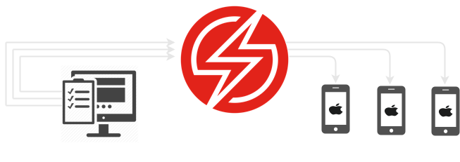
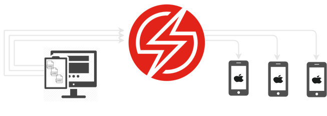
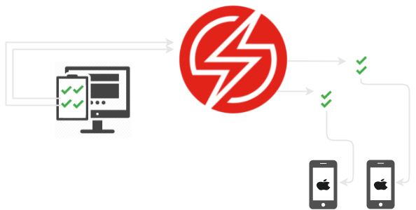

# XCUITest Sauce Config action
<style>
.label {
  color: white;
  padding: 8px;
  font-family: Arial;
}
.success {background-color: #04AA6D;} /* Green */
.danger {background-color: #f44336;} /* Red */ 
.info {background-color: #0000FF;} /* Blue */ 
</style>

<span class="label success">Real Device Support</span> <span class="label danger">Virtual Device Not Supported</span>

This page defines each of the configuration parameters that is required for running XCUI tests on the Sauce Labs platform. Please note, in order for you to use this plugin to execute UI tests, your test class names must proceed with `Spec`, `Specs`, `Tests`, or `Test`**, for example, `ExampleSpec`, `ExampleSpecs`, `ExampleTest`, `ExampleTests`. Your test case names must also begin with `test`, for example, `testIDoSomething`, `testIDoSomethingElse`. 

**These naming conventions are required so that this plugin can scan for test classes and their defined test cases**.

# Help
Information and help for the `sauce_config` action can be printed out by executed the following command:
```sh
fastlane action sauce_config
```
--------------------------------------------------------------------

# Parameters

<span class="label info">In order to execute tests you must specify a test plan or test target. Instructions on how to set are outlined below</span>

## `platform`

| Required   | Type     | Description                     | Options         |
|------------|----------|---------------------------------|-----------------|
| ***true*** | `String` | Application under test platform | `ios`           |   

---------------------------------------------------------------------
## `kind`

| Required   | Type     | Description                                                                                        | Options               |
|------------|----------|----------------------------------------------------------------------------------------------------|-----------------------|
| ***true*** | `String` | Specifies which framework is associated with the automation tests configured in this specification    | `xcuitest`            |   

---------------------------------------------------------------------
## `app`

| Required   | Type     | Description                            | 
|------------|----------|----------------------------------------|
| ***true*** | `String` | The path to the application under test |

---------------------------------------------------------------------
## `test_app`

| Required   | Type     | Description                                       | 
|------------|----------|---------------------------------------------------|
| ***true*** | `String` | The path to the testing application (test runner) |

---------------------------------------------------------------------
## `region`

| Required   | Type     | Description                                            | Options   |
|------------|----------|--------------------------------------------------------|-----------|
| ***true*** | `String` | Data Center region (us or eu), set using: region: 'eu' | `us`,`eu` |   

---------------------------------------------------------------------
## `retries`

| Required    | Type      | Description                                      | 
|-------------|-----------|--------------------------------------------------|
| ***false*** | `Integer` | Sets the number of times to retry a failed suite |

---------------------------------------------------------------------

## `test_target`

| Required    | Type     | Description                                                                                                                             | 
|-------------|----------|-----------------------------------------------------------------------------------------------------------------------------------------|
| ***false*** | `String` | Name of the Xcode test target name in order to scan for test classes and test cases to execute via your chosen test distribution method |

**Example**

```yaml
    test_target: 'NameOfMyUITestTarget'
```    

---------------------------------------------------------------------
## `test_plan`

| Required    | Type     |     | Description                                                                                                           | 
|-------------|----------|:----|-----------------------------------------------------------------------------------------------------------------------|
| ***false*** | `String` |     | Name of the Xcode test plan containing the tests that you wish to test/skip. |

**Example**

```yaml
    test_plan: 'NameOfMyTestPlan'
```    

---------------------------------------------------------------------

## `test_distribution`

| Required    | Type     | Description                   | 
|-------------|----------|-------------------------------|
| ***false*** | `String` | Test run distribution method. |


### What is `test_distribution`?
One of the only drawbacks of the native sauce platform is the long-running test runs or suite videos. Long-running videos make it difficult to debug failures, for example; if you have a single suite of tests that takes 10 minutes to execute, and that execution contains a single failure, you would need to scroll through a ten-minute video in order to view the test failure. This can be quite frustrating!
If you distribute suites by test case it may take slightly longer, however, you will save far more time debugging failures, and can save and share a short video of the exact failure.

## Test distribution options

The Saucectl plugin has the capabilities to either read a user specified Test Plan, or scan a UI Test target for test classes, and test cases. 
The plugin will then instruct saucectl to treat each specified option as a suite per specified real device(s).


| Distribution method       | Description                                                                    | 
|---------------------------|--------------------------------------------------------------------------------|
| `testCase`                | Considers 1 test case equal to 1 suite per device under test                   |
| `class`                   | Considers 1 test class to 1 suite per device under test                        |
| `shard`                   | Distributes test cases evenly between number of devices                        |

## `test_distribution: 'testCase'`



**Please note**, although this distribution method is available, it is **not recommended** for long running test suites. Hopefully in the future Sauce Labs will support virtual device testing for XCUITest, at that point this option will be useful as you can utilize your VM capacity. For now you can consider this as an experimental feature.

## `test_distribution: 'class'`



For example, given your project has three test classes, and I create a config with the following config:

```ruby
lane :create_config do
    sauce_config(platform: 'ios',
                 kind: 'xcuitest',
                 app: 'path/to/MyTestApp.ipa',
                 test_app: 'path/to/MyTestAppRunner.ipa',
                 region: 'eu',
                 devices: [ {name: 'iPhone 11'} ],
                 test_target: 'MyDemoAppUITests',
                 test_distribution: 'class'
                 )
end 
```


<details>
<summary>Would produce the following config.yaml</summary>
<pre>

```yaml
apiVersion: v1alpha
kind: xcuitest
retries: 0
sauce:
  region: eu-central-1
  concurrency: 3
  metadata:
    name: testing/somebuild-name-15
    build: 'Release '
xcuitest:
  app: path/to/MyTestApp.ipa
  testApp: path/to/MyTestAppRunner.ipa
artifacts:
  download:
    when: always
    match:
    - junit.xml
    directory: "./artifacts/"
reporters:
  junit:
    enabled: true
suites:
- name: testing/somebuild-name-15-firstSpec
  testOptions:
    class: EmiratesUITests.FirstSpec
  devices:
  - name: 'iPhone 11'
    orientation: portrait
    options:
      carrierConnectivity: false
      deviceType: PHONE
      private: true
- name: testing/somebuild-name-15-secondSpec
  testOptions:
   class: EmiratesUITests.SecondSpec
  devices:
   - name: 'iPhone 11'
     orientation: portrait
     options:
      carrierConnectivity: false
      deviceType: PHONE
      private: true
- name: testing/somebuild-name-15-thirdSpec
  testOptions:
   class: EmiratesUITests.ThirdSpec
  devices:
   - name: 'iPhone 11'
     orientation: portrait
     options:
      carrierConnectivity: false
      deviceType: PHONE
      private: true
```
</pre>
</details>

## `test_distribution: 'shard'`

There are two options for sharding XCUITests.
1. TestPlan
2. TestTarget

## TestPlan

It is possible to shard your UI tests when using Xcode test plan, therefore whatever test cases included in the test plan, the saucectl plugin will attempt to evenly distribute across your specified array of devices.  


For example, given your testPlan has four enabled test classes and I create a config with the following config:

```ruby
lane :create_config do
  sauce_config(platform: 'ios',
               kind: 'xcuitest',
               app: 'path/to/MyTestApp.ipa',
               test_app: 'path/to/MyTestAppRunner.ipa',
               region: 'eu',
               devices: [ {name: 'iPhone RDC One'}, {id: 'iphone_rdc_two'} ],
               test_plan: 'EnabledUITests',
               test_distribution: 'shard')
end 

```

<details>
<summary>Would produce the following config.yaml</summary>
<pre>

```yaml
---
apiVersion: v1alpha
kind: xcuitest
retries: 0
sauce:
  region: eu-central-1
  concurrency: 1
  metadata:
    name: unit-test-123
    build: 'Release '
xcuitest:
  app: "path/to/MyTestApp.ipa"
  testApp: "path/to/MyTestAppRunner.ipa"
artifacts:
  download:
    when: always
    match:
    - junit.xml
    directory: "./artifacts/"
reporters:
  junit:
    enabled: true
suites:
- name: unit-test-123-shard 1
  testOptions:
    class:
    - MyDemoAppUITests.SomeSpec/testTwo
    - MyDemoAppUITests.SomeSpec/testThree
  devices:
  - name: iPhone RDC One
    orientation: portrait
    options:
      carrierConnectivity: false
      deviceType: PHONE
      private: true
- name: unit-test-123-shard 2
  testOptions:
    class:
    - MyDemoAppUITests.SomeSpec/testFour
    - MyDemoAppUITests.SomeSpec/testFive
  devices:
  - id: iphone_rdc_two
    orientation: portrait
    options:
      carrierConnectivity: false
      deviceType: PHONE
      private: true
```
</pre>
</details>

## TestTarget
When a `testTarget` is specified the saucectl plugin will scan the specified testTarget for test classes and will distribute evenly (where possible) across given array of devices.


For example, given I create a config with the following:

```ruby
lane :create_config do
  sauce_config(platform: 'ios',
               kind: 'xcuitest',
               app: 'path/to/MyTestApp.ipa',
               test_app: 'path/to/MyTestAppRunner.ipa',
               region: 'eu',
               devices: [ {name: 'iPhone RDC One'}, {id: 'iphone_rdc_two'} ],
               test_target: 'MyDemoAppUITests',
               test_distribution: 'shard')
end
```

Would produce the following config:

<details>
<summary>Would produce the following config.yaml</summary>
<pre>

```yaml
---
apiVersion: v1alpha
kind: xcuitest
retries: 0
sauce:
  region: eu-central-1
  concurrency: 1
  metadata:
    name: unit-test-123
    build: 'Release '
xcuitest:
  app: "path/to/MyTestApp.ipa"
  testApp: "path/to/MyTestAppRunner.ipa"
artifacts:
  download:
    when: always
    match:
    - junit.xml
    directory: "./artifacts/"
reporters:
  junit:
    enabled: true
suites:
- name: unit-test-123-shard 1
  testOptions:
    class:
    - MyDemoAppUITests.NavigationTest
    - MyDemoAppUITests.ProductDetailsTest
  devices:
  - name: iPhone RDC One
    orientation: portrait
    options:
      carrierConnectivity: false
      deviceType: PHONE
      private: true
- name: unit-test-123-shard 2
  testOptions:
    class:
    - MyDemoAppUITests.ProductListingPageTest
  devices:
  - id: iphone_rdc_two
    orientation: portrait
    options:
      carrierConnectivity: false
      deviceType: PHONE
      private: true
```
</pre>
</details>

----------------------------------------------------------------------------

## `test_class`

| Required | Type    | Description                                                                                                                                                                                                                                           | 
|----------|---------|-------------------------------------------------------------------------------------------------------------------------------------------------------------------------------------------------------------------------------------------------------|
| `false`  | `Array` | Specify an array of tests to execute. |


**Example:**

```yaml
    test_class: ['MyDemoAppUITests.SomeClassOne', 'MyDemoAppUITests.SomeClassTwo', 'MyDemoAppUITests.SomeClassThree', 'MyDemoAppUITests.SomeClassFour']
```    

---------------------------------------------------------------------

## `devices`

The parent property that defines details for running this suite on real devices. You can request a specific device using its ID, or you can specify a set of criteria to choose the first available device that matches the specifications.

| Required | Type    | Description                                                                                                                                                                                                                                                                                                                                 | 
|----------|---------|---------------------------------------------------------------------------------------------------------------------------------------------------------------------------------------------------------------------------------------------------------------------------------------------------------------------------------------------|
| `false`  | `Array` | The parent property that defines details for running this suite on [real devices](https://docs.saucelabs.com/mobile-apps/automated-testing/espresso-xcuitest/espresso/#devices). You can request a specific device using its ID, or you can specify a set of criteria to choose the first available device that matches the specifications. |


Below are the options available when using the running the tests on real devices.

`id`

When an ID is specified, it supersedes the other settings.

**Example**

```yaml
  devices: [ {id: 'iphone_11_pro_max_us'} ]
```

`name`

Find a device for this test suite that matches the device name or portion of the name, which may provide a larger pool of available devices of the type you want.

**Example** 

Complete Name:

```yaml
    devices: [ {name: 'iPhone 11'} ]
```

Pattern Matching:

```yaml
    devices: [ {name: 'iPhone.*'} ]
```

`platformVersion`

Request that the device matches a specific platform version.


**Example**

```yaml
    devices: [ {name: 'iPhone.*', platformVersion: 15.3} ]
```

`orientation`

The orientation of the device. Default: `portrait`

**Example**

```yaml
    devices: [ {name: 'iPhone.*', platformVersion: 15.3, orientation: 'landscape' } ]
```

`device_type`

Request that the matching device is a specific type of device. Valid values are: ANY TABLET PHONE any tablet phone

**Example**

```yaml
    devices: [ {name: 'iPad.*', platformVersion: 16.3, device_type: 'TABLET' } ]
```    

`private`

Request that the matching device is from your organization's private pool only. Default: TRUE

**Example**

```yaml
    devices: [ {name: 'iPad.*', platformVersion: 16.3, private: false } ]
```    

`carrier_connectivity`

Request that the matching device is also connected to a cellular network. Default: false

**Example**

```yaml
    devices: [ {name: 'iPad.*', platformVersion: 16.3, carrier_connectivity: true } ]
```    

---------------------------------------------------------------------

## `max_concurrency_size`

| Required    | Type      | Description                                  | 
|-------------|-----------|----------------------------------------------|
| ***false*** | `Integer` | Sets the maximum number of suites to execute at the same time. If the test defines more suites than the max, excess suites are queued and run in order as each suite completes |

**Example**

```yaml
    max_concurrency_size: 20
```
---------------------------------------------------------------------

## `timeout`

| Required    | Type      | Description                                  | 
|-------------|-----------|----------------------------------------------|
| ***false*** | `String` | Instructs how long (in ms, s, m, or h) saucectl should wait for each suite to complete. You can override this setting for individual suites using the timeout setting within the suites object. If not set. Default value is 0 (unlimited) |

**Example**

```yaml
    timeout: 60
```    
---------------------------------------------------------------------

